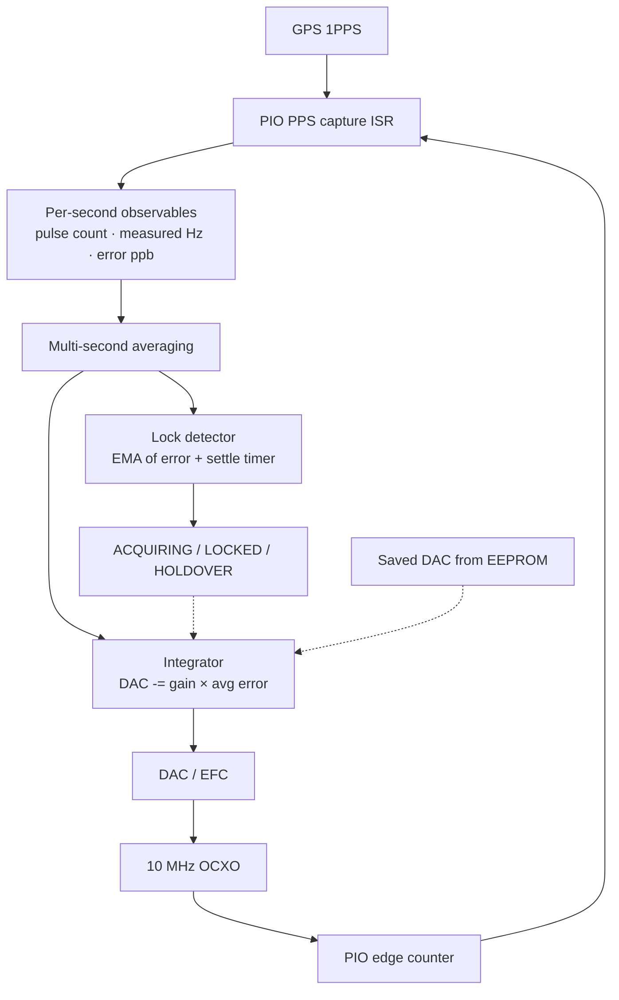

# Reference Locking Technical Notes

This is the technical companion to the main README. It describes how the
firmware actually locks the 10 MHz OCXO to GPS and what all the pieces do.

## 1) What the loop does

The whole point of the disciplining loop is to keep a local 10 MHz OCXO
tightly on frequency, steered by GPS 1PPS. Once the OCXO is disciplined,
it clocks both ADF4351 synthesisers.

In broad strokes:

1. Detect each GPS 1PPS rising edge.
2. Count how many 10 MHz cycles occurred during that one-second window.
3. Work out the frequency error in ppb.
4. Average that error over several seconds (`DISC_AVERAGE_SECS`).
5. Nudge the DAC (which controls the OCXO EFC voltage) by the integral
   of the averaged error.
6. Only declare "locked" once the error has been small *and* the DAC has
   stopped moving for long enough to be credible.

Here is the signal flow through the loop:

---

## 2) How the measurement works

### 2.1 PPS capture

A PIO state machine watches the GPS 1PPS line. When it sees a rising edge
it fires `PIO0_IRQ_0`, and the ISR grabs a microsecond timestamp from
`timer_hw->timerawl`.

That gives us the PPS interval to 1 µs resolution — good enough for the
interval term in the frequency calculation, though it is *not* the
limiting factor for frequency accuracy (the edge count is).

### 2.2 Counting 10 MHz edges — the "counter around zero" model

The easiest way to think about the frequency measurement is this:

Imagine a virtual counter that starts at zero. Every rising edge of the
10 MHz OCXO **subtracts 1**. Every GPS 1PPS pulse **adds 10,000,000**.
If the oscillator is running at exactly 10 MHz, the counter stays at
zero — exactly 10 million edges arrive between each PPS, and the add
cancels the subtract perfectly. If the OCXO is running a little fast,
more than 10 million edges pile up and the counter drifts negative. If
it's a bit slow, fewer edges arrive and the counter drifts positive.

The value in the counter at any moment is the accumulated frequency
error in units of 10 MHz cycles. Over a multi-second window, summing
N one-second residuals gives the same number that a single free-running
counter would have reached — no edges are missed or double-counted, so
the two views are mathematically identical.

> **Implementation note:** the firmware doesn't literally maintain a
> running accumulated counter. Instead, a PIO state machine decrements
> its X register on every 10 MHz rising edge, and the PPS ISR snapshots
> X each second to compute the per-second delta
> (`edgesThisSec = prevX − currentX`). The one-second residual is then
> just `edgesThisSec − 10,000,000`. This is equivalent to the virtual
> counter model above but avoids the need for a 64-bit running total
> and any concern about wrap. The multi-second average is the sum of
> these per-second residuals divided by the window length.

From the per-second edge count the maths is straightforward:

$$
f_{meas} = \frac{N_{10MHz}}{T_{pps}}
$$

where $N_{10MHz}$ is the pulse count and $T_{pps}$ is the measured PPS
interval in seconds. Frequency error in ppb:

$$
error_{ppb} = \frac{f_{meas} - f_{nominal}}{f_{nominal}} \cdot 10^9
$$

---

## 3) The control loop

Every `DISC_AVERAGE_SECS` seconds the main loop hands the discipliner an
averaged frequency error. The discipliner is a pure integrator — there is
no proportional term. It simply adjusts the DAC by `i_gain × avg_error`
each update.

When the loop is locked the gain is reduced by `DISC_I_GAIN_LOCKED_RATIO`
(currently ×0.25) so that small residual noise doesn't keep jiggling the
DAC around. If lock is lost the full acquisition gain kicks back in.

On power-up the firmware reads the last-known DAC value from EEPROM and
seeds the integrator with it, so the OCXO starts very close to where it
left off rather than hunting from the middle of the DAC range.

The DAC output is hard-clamped to `DAC_MIN..DAC_MAX` so the integrator
can never rail.

### State machine

| State | Meaning |
|------------|--------------------------------------------------|
| WARMUP | Waiting for GPS fix and initial settling |
| ACQUIRING | Loop is running, not yet meeting lock criteria |
| LOCKED | Error is small and DAC has settled — full lock |
| HOLDOVER | GPS lost, DAC is frozen at last good value |
| FREERUN | No GPS available, running open-loop |

---

## 4) Telemetry

The firmware sends two kinds of JSON messages over the serial link.

**OCXO event** (every second) — carries the raw measurement:
`pulse_count`, `measured_hz`, `freq_error_ppb`.

**Status** (periodic) — carries the full system snapshot: GPS fix,
DAC value, ADF lock-detect states, discipliner state, plus averaging
visibility fields (`disc_avg_window_s`, `disc_avg_phase_ns`) so the
monitor app can show what the loop is doing.

---

## 5) Timing resolution

The RP2350 runs at 150 MHz, so one system clock tick is about 6.67 ns.
The PPS interval timestamp comes from a microsecond timer though, so
the interval measurement itself is only good to ~1 µs. That sounds
coarse, but it only enters the frequency calculation as the denominator
— the numerator (10 million edge counts) does the heavy lifting.

In practice, the 1-second gated count gives about ±0.1 Hz resolution,
and averaging over several seconds smooths that further.

---

## 6) Why PIO edge counting?

Earlier firmware versions tried various approaches. The current PIO
counting method won out because it:

- counts every single 10 MHz edge without burning CPU time,
- avoids per-edge interrupts entirely (PIO does it in hardware),
- gives a clean integer count each second,
- pairs naturally with multi-second averaging for sub-ppb control.

---

## 7) ADF lock detect

The two ADF4351 PLLs have their own lock-detect pins (`ADF1_LD_PIN`,
`ADF2_LD_PIN`). These are read directly by the firmware and drive the
status LEDs, alarm logic, and the lock fields in telemetry JSON. They
are independent of the OCXO disciplining lock — they tell you whether
each synthesiser PLL is happy with its own loop.

---

## 8) How lock detection actually works

We deliberately don't declare lock just because the frequency error
happens to be small for a moment. The firmware uses a multi-condition
approach:

1. **Error EMA** — an exponential moving average of the absolute
   correction error (α = 0.1) must drop below the *enter* threshold.
2. **Hysteresis** — once locked, the EMA must exceed a wider *exit*
   threshold before lock is dropped. This stops the status flickering
   on borderline noise.
3. **DAC settling** — the DAC must not have moved by more than a few
   counts for a configurable period (currently 120 s). This catches
   the case where a warm restart seeds a good DAC value but the OCXO
   hasn't truly stabilised yet.
4. **Dwell time** — all of the above must remain true for a minimum
   continuous period before lock is asserted.

The net effect is that a cold start takes a couple of minutes to lock,
and a warm restart (where the saved DAC is close) still waits for the
DAC to genuinely stop moving before claiming lock. It's conservative
on purpose — better to show ACQUIRING for an extra minute than to
flash LOCKED prematurely.

---

## 9) Quick reference

| What | How |
|------|-----|
| PPS edge detection | PIO state machine, ISR timestamp |
| Frequency measurement | PIO edge count of 10 MHz per PPS window |
| Control update rate | Once per `DISC_AVERAGE_SECS` seconds |
| Loop type | Pure integrator (no P term) |
| DAC persistence | Saved to EEPROM, restored on restart |
| Lock criteria | Low error EMA + settled DAC + dwell time |
| Gain management | Reduced gain when locked, full gain when acquiring |
