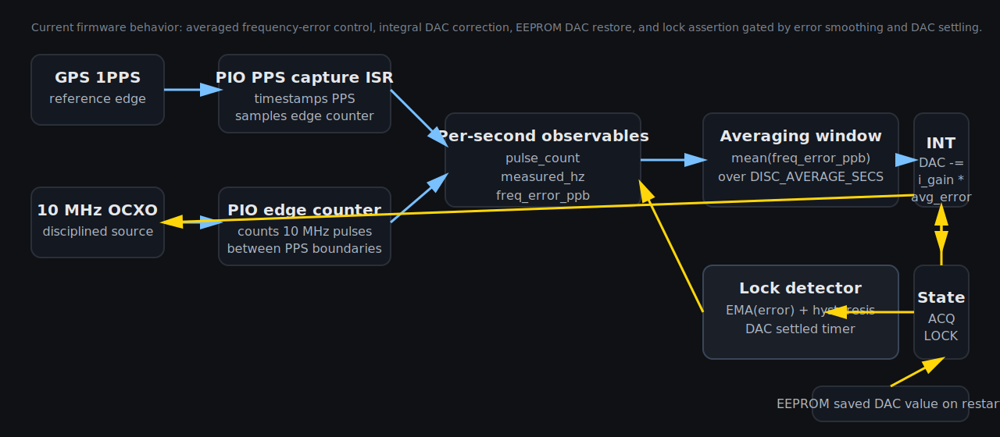
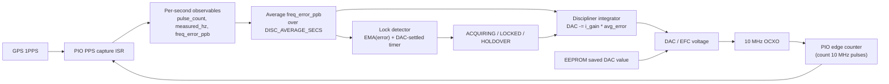

# Reference Locking Technical Notes

This document is the technical companion to the main user README.
It describes the current reference-locking architecture used in firmware.

## 1) System objective

The GPSDO loop disciplines a local 10 MHz reference to GPS 1PPS.
That disciplined 10 MHz then drives ADF4351 synthesis.

Top-level control flow:

1. Detect each GPS 1PPS edge.
2. Measure PPS interval and 10 MHz pulse count over that PPS window.
3. Compute per-second frequency error (ppb) and status observables.
4. Average frequency error over multiple seconds (`DISC_AVERAGE_SECS`).
5. Apply the integral correction to DAC/EFC.
6. Declare lock only after error is low and DAC motion has settled.

Control-loop signal flow:

---

## 2) Measurement architecture (current)

### 2.1 PPS capture

- A PIO state machine detects PPS edges.
- `PIO0_IRQ_0` ISR timestamps the edge using `timer_hw->timerawl` (microsecond counter).

So PPS interval / phase observable resolution in the present implementation is based on 1 µs timer ticks.
This applies to timestamp-derived phase error, not to the 10 MHz edge-count observable itself.

### 2.2 10 MHz pulse counting per PPS window

The 10 MHz input is counted continuously by a dedicated PIO state machine:

- one state machine waits on each rising edge of the 10 MHz input,
- the PIO X register counts edges between PPS boundaries,
- at each PPS ISR, firmware snapshots the counter state and forms a delta.

This yields pulse count per PPS interval:

$$
N_{10MHz} = X_{prev} - X_{now}
$$

Frequency estimate per PPS interval:

$$
f_{meas} = \frac{N_{10MHz}}{T_{pps}}
$$

with $T_{pps}$ from measured PPS interval in seconds.

Frequency error in ppb:

$$
error_{ppb} = \frac{f_{meas} - f_{nominal}}{f_{nominal}} \cdot 10^9
$$

---

## 3) Control loop and averaging

The discipliner receives the averaged frequency error and GPS validity.

Key loop characteristics:

- integral gain: `DISC_I_GAIN`
- locked-loop gain reduction: `DISC_I_GAIN_LOCKED_RATIO`
- output clamp: `DAC_MIN..DAC_MAX`
- lock detection: error EMA plus DAC-settled timing and hysteresis
- frequency-error averaging window: `DISC_AVERAGE_SECS`
- DAC operating point is restored from EEPROM on restart when available

State machine remains:

- `WARMUP`
- `ACQUIRING`
- `LOCKED`
- `HOLDOVER`
- `FREERUN`

---

## 4) Telemetry signals

### 4.1 OCXO event telemetry

`event: "ocxo"` now includes:

- `pulse_count`
- `measured_hz`
- `freq_error_ppb`

### 4.2 Periodic status telemetry

Status JSON includes averaging visibility fields:

- `disc_avg_window_s`
- `disc_avg_phase_ns`

and the standard lock/GPS/DAC/ADF fields.

---

## 5) Timing-resolution notes

Clock-period references still hold:

$$
T = \frac{1}{f_{sysclk}}
$$

Examples:

- ~60.6 MHz → ~16.5 ns
- 150 MHz → ~6.67 ns

Those values are the hardware clock period scale.
Current PPS interval timestamping (used for phase error) is still read via microsecond timer in ISR.
The frequency observable is based on PPS-gated 10 MHz edge counting, with timer quantization entering through the interval term in $f_{meas}=N/T$.

---

## 6) Why this is better than the previous path

Compared with the earlier simplified frequency path, the current method:

- measures true pulse count over each PPS window,
- avoids high-rate per-edge CPU interrupts,
- provides a direct ppb observable each second,
- supports stable control with multi-second averaging.

This architecture is a practical, low-overhead step toward tighter reference disciplining.

---

## 7) ADF lock and alarm context

ADF lock detect pins (`ADF1_LD_PIN`, `ADF2_LD_PIN`) remain the runtime lock truth source.
They drive status LEDs, alarm logic, and lock-related JSON fields.

---

## 8) Practical summary

- PPS edge timing: PIO-detected, ISR timestamped.
- Frequency observable: PPS-window pulse count of 10 MHz.
- Control update: averaged frequency error over `DISC_AVERAGE_SECS`.
- Loop action: integral-only correction into DAC/EFC.
- Restart behavior: restore prior saved DAC operating point, then reacquire/lock.
- Telemetry now exposes averaging and pulse-count observables for verification/tuning.

## 9) Current lock behavior

Lock is intentionally not asserted immediately just because the saved DAC value starts near the final operating point.

The firmware currently requires all of the following before entering `LOCKED`:

- averaged correction error remains below the enter threshold,
- the error EMA stays inside the hysteresis window,
- the DAC has stopped moving materially for the configured settle interval,
- the minimum continuous dwell time has elapsed.

This makes hot restarts behave more realistically: the OCXO may still be warm and close to frequency, but the loop does not claim lock until the DAC has genuinely settled.
