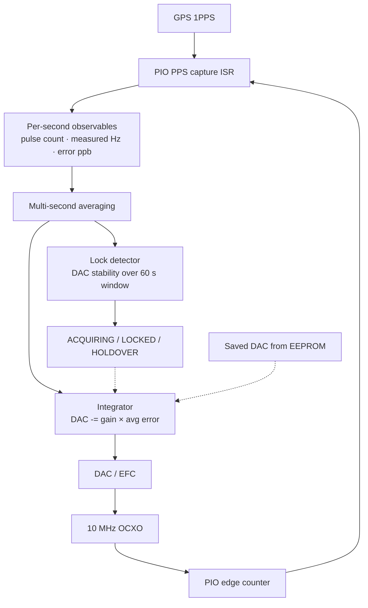

# Reference Locking Technical Notes

This is the technical companion to the main README. It describes how the
firmware actually locks the 10 MHz OCXO to GPS and what all the pieces do.

## 1) What the loop does

The whole point of the disciplining loop is to keep a local 10 MHz OCXO
tightly on frequency, steered by GPS 1PPS. Once the OCXO is disciplined,
it clocks both ADF4351 synthesisers.

In broad strokes:

1. Detect each GPS 1PPS rising edge.
2. Count how many 10 MHz cycles occurred during that one-second window.
3. Work out the frequency error in ppb.
4. Keep a rolling average of the last N seconds of error.
5. Every second, nudge the DAC (which controls the OCXO EFC voltage) by
   the integral of the rolling-average error, scaled by 1/N so the loop
   bandwidth stays constant regardless of the window length.
6. Only declare "locked" once the DAC output has been stable (not moving
   much) for long enough to be credible.

Here is the signal flow through the loop:

---

## 2) How the measurement works

### 2.1 PPS capture

A PIO state machine watches the GPS 1PPS line. When it sees a rising
edge it fires `PIO0_IRQ_0`, which triggers the edge-counter snapshot
described below.

We trust the GPS 1PPS to *be* one second — GPS 1PPS accuracy is
typically ±30 ns, which is far better than anything we could measure
on-chip. So the gate interval is simply one second by definition, and
the edge count over that gate *is* the OCXO frequency in Hz. No
division by a measured interval is needed or done.

### 2.2 Counting 10 MHz edges — the "counter around zero" model

The easiest way to think about the frequency measurement is this:

Imagine a virtual counter that starts at zero. Every rising edge of the
10 MHz OCXO **subtracts 1**. Every GPS 1PPS pulse **adds 10,000,000**.
If the oscillator is running at exactly 10 MHz, the counter stays at
zero — exactly 10 million edges arrive between each PPS, and the add
cancels the subtract perfectly. If the OCXO is running a little fast,
more than 10 million edges pile up and the counter drifts negative. If
it's a bit slow, fewer edges arrive and the counter drifts positive.

The value in the counter at any moment is the accumulated frequency
error in units of 10 MHz cycles. Over a multi-second window, summing
N one-second residuals gives the same number that a single free-running
counter would have reached — no edges are missed or double-counted, so
the two views are mathematically identical.

> **Implementation note:** the firmware doesn't literally maintain a
> running accumulated counter. Instead, a PIO state machine decrements
> its X register on every 10 MHz rising edge, and the PPS ISR snapshots
> X each second to compute the per-second delta
> (`edgesThisSec = prevX − currentX`). The one-second residual is then
> just `edgesThisSec − 10,000,000`. This is equivalent to the virtual
> counter model above but avoids the need for a 64-bit running total
> and any concern about wrap. The multi-second average is the sum of
> these per-second residuals divided by the window length.

From the per-second edge count, the frequency error is simply:

$$
error_{Hz} = N_{edges} - 10{,}000{,}000
$$

Because the PPS gate *is* one second, the edge count *is* the frequency
in Hz — no division required. The error in ppb is just that scaled up:

$$
error_{ppb} = \frac{error_{Hz}}{10{,}000{,}000} \cdot 10^9 = error_{Hz} \times 100
$$

A **sanity gate** rejects any reading where the error exceeds ±50 kHz
(±0.5%). This catches partial first-second counts after a warm reset
(the PIO counter starts mid-PPS period and gets a nonsense edge count)
and cold OCXO startup where the crystal hasn't reached full amplitude
yet. Rejected readings are marked invalid so they never reach the
rolling average, the integrator, or the lock detector.

---

## 3) The control loop

The firmware maintains a rolling ring buffer of per-second frequency
error samples. Every second, it computes the mean over the most recent
N samples and passes that to the discipliner. The discipliner is a pure
integrator — there is no proportional term. It adjusts the DAC by
`i_gain / N × avg_error` each second, where the division by N keeps the
effective loop bandwidth constant regardless of the averaging window.

The loop runs in two modes:

- **Acquiring** — uses a short window (`DISC_AVERAGE_SECS / 4`, e.g. 8 s)
  with the full I gain for fast pull-in.
- **Locked** — switches to the full window (`DISC_AVERAGE_SECS`, e.g. 32 s)
  and reduces the gain by `DISC_I_GAIN_LOCKED_RATIO` (currently ×0.25)
  for stability. The longer window plus the lower gain together narrow
  the loop bandwidth considerably, so small residual noise doesn't keep
  jiggling the DAC around.

If lock is lost the short window and full gain kick back in.

On power-up the firmware reads the last-known DAC value from EEPROM and
seeds the integrator with it, so the OCXO starts very close to where it
left off rather than hunting from the middle of the DAC range.

The DAC output is hard-clamped to `DAC_MIN..DAC_MAX` so the integrator
can never rail.

### State machine

| State | Meaning |
|------------|--------------------------------------------------|
| WARMUP | Waiting for GPS fix and initial settling |
| ACQUIRING | Loop is running, not yet meeting lock criteria |
| LOCKED | Error is small and DAC has settled — full lock |
| HOLDOVER | GPS lost, DAC is frozen at last good value |
| FREERUN | No GPS available, running open-loop |

---

## 4) Telemetry

The firmware sends two kinds of JSON messages over the serial link.

**OCXO event** (every second) — carries the raw measurement:
`pulse_count`, `measured_hz`, `freq_error_ppb`.

**Status** (periodic) — carries the full system snapshot: GPS fix,
DAC value, ADF lock-detect states, discipliner state, plus averaging
visibility fields (`disc_avg_window_s`, `disc_avg_freq_ppb`) so the
monitor app can show what the loop is doing.

---

## 5) Timing resolution

The PIO edge counter runs at the system clock (150 MHz, ~6.67 ns per
tick), but that's just the speed at which PIO executes its instructions
— the actual measurement resolution comes from counting complete 10 MHz
edges over a one-second gate. The gate itself is GPS 1PPS, which we
trust to be exactly one second (GPS 1PPS is accurate to ~30 ns).

So the frequency resolution is ±1 Hz per single-second gate (one edge
more or less), and averaging over several seconds smooths that further.

---

## 6) Why PIO edge counting?

Earlier firmware versions tried various approaches. The current PIO
counting method won out because it:

- counts every single 10 MHz edge without burning CPU time,
- avoids per-edge interrupts entirely (PIO does it in hardware),
- gives a clean integer count each second,
- pairs naturally with multi-second averaging for sub-ppb control.

---

## 7) ADF lock detect

The two ADF4351 PLLs have their own lock-detect pins (`ADF1_LD_PIN`,
`ADF2_LD_PIN`). These are read directly by the firmware and drive the
status LEDs, alarm logic, and the lock fields in telemetry JSON. They
are independent of the OCXO disciplining lock — they tell you whether
each synthesiser PLL is happy with its own loop.

---

## 8) How lock detection actually works

Frequency-error readings are inherently noisy — GPS 1PPS jitter can
produce occasional outliers of ±1300 ppb (±13 Hz) even when the OCXO is
perfectly stable. Trying to judge lock from the frequency error alone
turns out to be unreliable because those outliers poison any simple
threshold or average.

What *does* tell us whether the loop has converged is the DAC output.
When the integrator has found the right EFC voltage, the DAC value
stops moving — it just sits there, with small corrections that don't
add up to much. If the OCXO is genuinely drifting, the DAC has to
chase it and the value trends steadily in one direction.

The firmware keeps a ring buffer of the last 60 per-second DAC
snapshots and looks at the range (max − min) over that window:

- **Lock is entered** when the DAC range over 60 seconds is
  ≤ `DISC_LOCK_DAC_RANGE_ENTER` (currently 30 counts) and the DAC is
  not railed at `DAC_MIN` or `DAC_MAX`.
- **Lock is dropped** when the range exceeds
  `DISC_LOCK_DAC_RANGE_EXIT` (currently 50 counts).

The hysteresis between the enter and exit thresholds prevents the state
from flickering on borderline noise.

The lock buffer is only populated while the discipliner is in ACQUIRING
or LOCKED state — during FREERUN or WARMUP a constant DAC value would
otherwise fill the buffer and falsely declare lock. If lock is lost the
buffer is reset so the full 60-second dwell is required again.

Because the buffer must be full (60 seconds of stable DAC data) before
lock is even considered, this naturally prevents premature lock on cold
start or warm restart — the loop has to have converged and settled for
a solid minute before the firmware will claim it's locked.

---

## 9) Quick reference

| What | How |
|------|-----|
| PPS edge detection | PIO state machine, ISR fires on rising edge |
| Frequency measurement | PIO edge count of 10 MHz per 1PPS gate |
| Control update rate | Every second (rolling average) |
| Loop type | Pure integrator (no P term), I gain scaled by 1/window |
| Averaging window | Acquiring: base/4 (8 s), Locked: base (32 s) |
| DAC persistence | Saved to EEPROM, restored on restart |
| Lock criteria | 60 s DAC ring buffer: range ≤ 30 counts to enter, > 50 to exit |
| Gain management | Reduced gain + longer window when locked; full gain + short window when acquiring |
