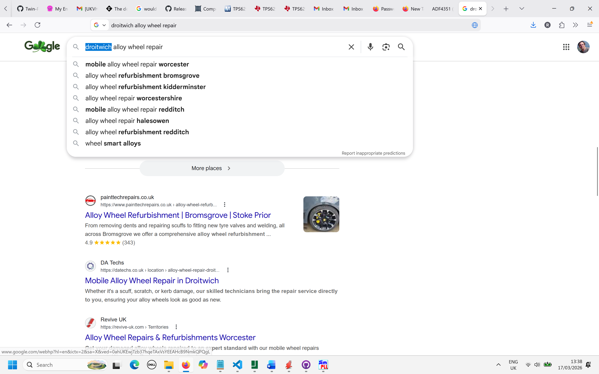
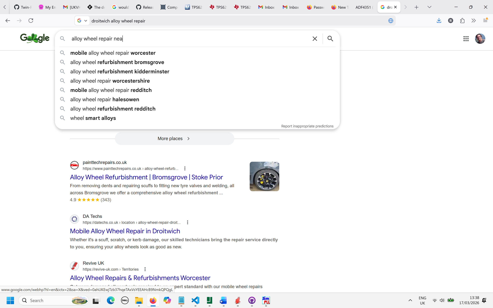
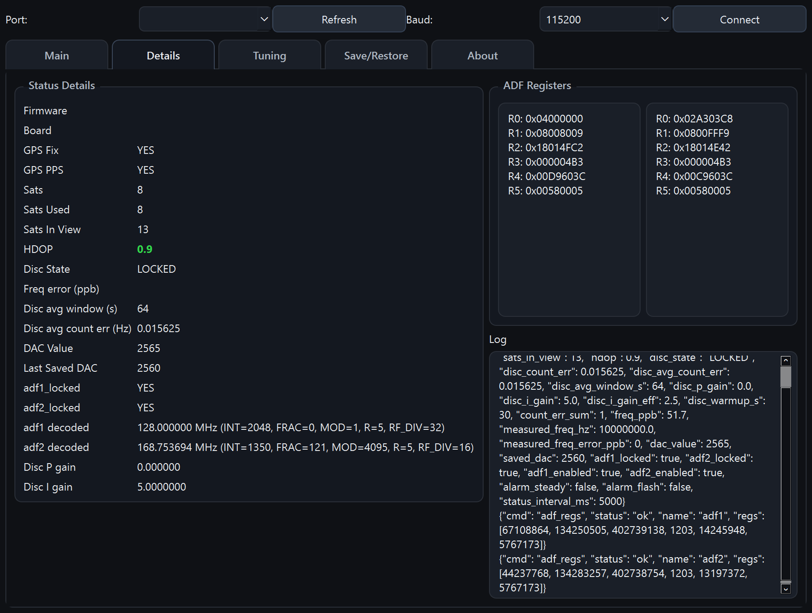
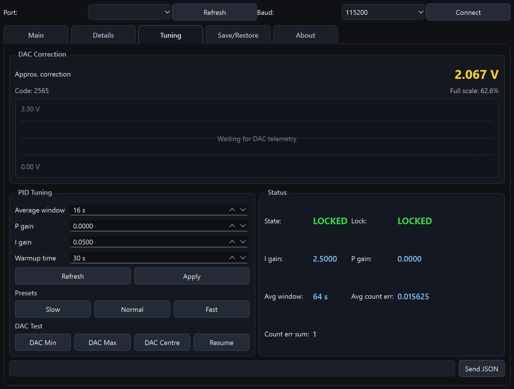
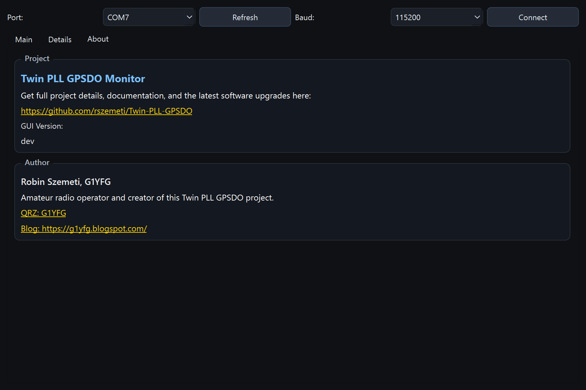

# Twin PLL GPSDO Configuration Tool — User Manual

**Release Version:** `{{RELEASE_TAG}}`

This manual covers the desktop configuration tool software (`monitor/gpsdo_monitor.py` / packaged EXE).

## 1. What the monitor does

The configuration tool is the control and visibility front-end for your Twin PLL GPSDO firmware.

You can:
- connect to the device over serial,
- view live lock/health telemetry,
- set output frequency for PLL1 and PLL2,
- push raw ADF4351 registers,
- inspect decoded register state and JSON logs,
- confirm GUI build version in About.

## 2. Start-up

### 2.1 Connect
1. Launch the configuration tool.
2. Select the correct COM port.
3. Select baud (normally `115200`).
4. Click **Connect**.

After connecting, the configuration tool automatically requests device info and ADF register snapshots.

### 2.2 If connection fails
- Verify the COM port is correct.
- Close other terminal/serial apps that may hold the port.
- Confirm firmware is running and emitting JSON status.

---

## 3. UI overview

The application has four main tabs:
- **Main**
- **Details**
- **Advanced**
- **About**

Screenshot source:
- **PLL1** with **Set O/P 1** and **Registers**
- **PLL2** with **Set O/P 2** and **Registers**

The frequency text in each card is decoded from live register readback.

### 4.2 Front Status
- GPS Fix
- GPS Lock
- Disciplined
- ADF1 Lock
- ADF2 Lock

### 7.5 Discipliner Control
The Advanced tab includes runtime loop controls:
- **Average window (s)**
- **P gain**
- **I gain**

Use **Refresh** to read current firmware values, and **Apply** to send updates without rebooting.
Preset buttons (**Slow**, **Normal**, **Fast**) provide one-click tuning profiles and apply immediately.
Applied values are saved in firmware persistent storage and restored on reboot.

### 7.6 Step Response Tool
Use **Step Response...** in **Discipliner Control (Advanced tab)** to open the step test dialog.

The tool can:
- apply a timed DAC step (baseline then step),
- optionally use near-open-loop gains for the test,
- temporarily set status telemetry to 1 Hz,
- capture response samples,
- export captured data to CSV.

Step-test temporary loop changes are applied in non-persistent mode, so they are not written to EEPROM.

- green/red used for good/bad lock-type status,
- alarm flashes if firmware reports flash alarm condition.

---

## 5. Setting PLL frequency (calculated mode)

Use this for normal operation.

### 5.1 Set O/P 1
1. Click **Set O/P 1**.
2. Enter desired output frequency and reference settings.
3. Choose synthesis mode:
   - Auto (prefer Integer-N, fallback Fractional-N)
   - Integer-N only
   - Fractional-N only
4. Optionally tune RF power / noise mode / charge pump current.
5. Click OK to send computed `set_all` registers and program the device.

### 5.2 Set O/P 2
Same process as PLL1.

> PLL2 workflow is intentionally identical to PLL1.

---

## 6. Raw register programming (advanced)

Use this when you already have exact register words.

### 6.1 Open raw dialog
- Click **Registers** on PLL1 or PLL2 card.

### 6.2 Input format
Enter six 32-bit hex words in **R5..R0** order.

Accepted forms include:
- `0x00580005`
- `R5: 0x00580005`
- comma-separated values

The configuration tool validates count and range, then maps to firmware `R0..R5` payload order automatically.

### 6.3 Program behavior
On OK, monitor sends:
- `cmd`: `adf1` or `adf2`
- `action`: `set_all`
- `regs`: six values
- `program`: `true`

Firmware then applies and (if enabled) persists settings.

---

## 7. Details tab

The Details tab is for deep visibility and manual control.

### 7.1 Status Details panel
Shows telemetry such as:
- Firmware version
- Board
- GPS fix / PPS
- Satellites used/in-view
- HDOP (with color coding)
- Disciplined state
- Phase error
- Averaging window and averaged phase
- DAC value
- ADF lock states
- Decoded ADF outputs

### 7.2 ADF Registers panel
Displays current register words for ADF1 and ADF2.

### 7.3 Log panel
Shows:
- firmware JSON events,
- warnings/errors,
- command TX lines,
- non-periodic operational events.

### 7.4 Send JSON box (Advanced tab)
Manual command entry for advanced operation.

Example:
- `{\"cmd\":\"dac\",\"value\":2048}`

---

## 8. About tab

The About tab contains:
- project links,
- author links,
- **GUI Version** (the monitor build version).

Important distinction:
- About shows GUI version (local app build),
- device firmware version is shown in Details.

---

## 9. EEPROM/write success behavior

When firmware confirms successful EEPROM write, the configuration tool shows a **Device Updated** popup and logs the associated JSON event.

---

## 10. Practical operating flow

Recommended daily flow:
1. Connect.
2. Check Main LEDs (GPS, lock, alarm).
3. Set PLL1 and/or PLL2 using **Set O/P**.
4. Use **Registers** only for explicit register workflows.
5. Confirm status/logs in Details.

---

## 11. Troubleshooting

### 11.1 No live updates
- Verify serial connection and baud.
- Confirm firmware is outputting JSON status.

### 11.2 Set O/P does nothing
- Check connection state first.
- Watch log panel for TX failure or firmware error response.

### 11.3 Raw register dialog rejects input
- Ensure exactly 6 words are provided.
- Ensure values are valid 32-bit hex.
- Ensure input order is R5..R0.

### 11.4 LED states look inconsistent
- Wait for GPS to settle after startup.
- Check Details values (`gps_fix`, `gps_pps`, ADF lock fields, alarm flags).

---

## 12. Notes for release artifacts

In release builds:
- About → GUI Version reflects release tag.
- Firmware `info` reports firmware version tag.

For local dev runs, GUI version defaults to `dev` unless build metadata is injected.
